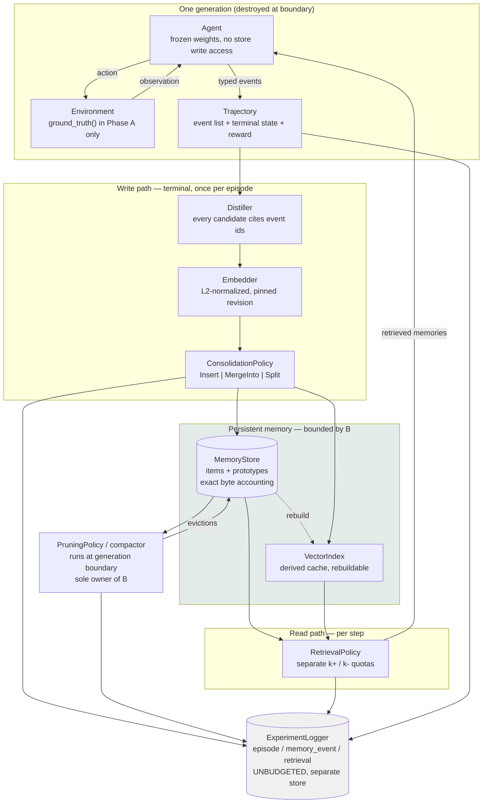
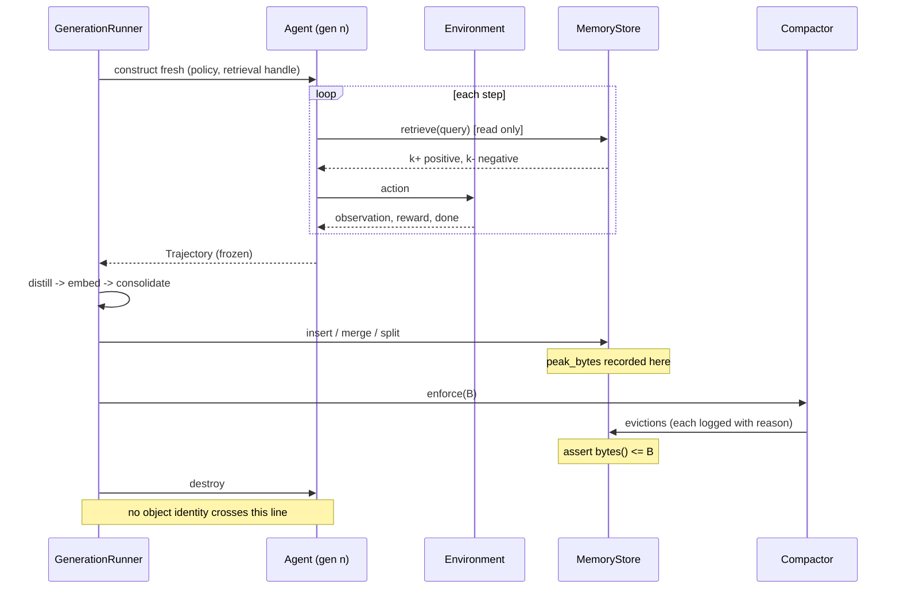
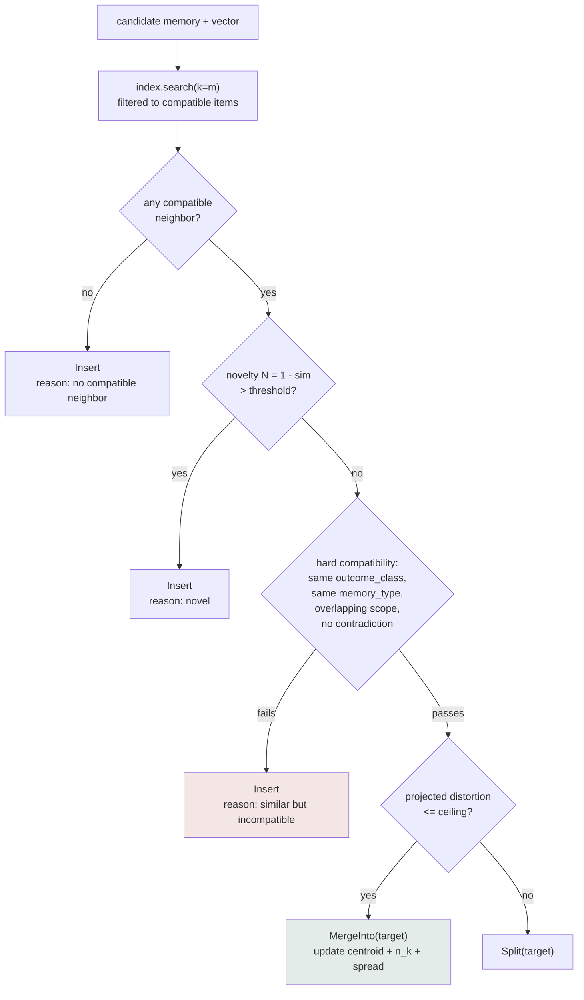
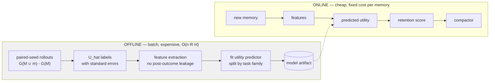
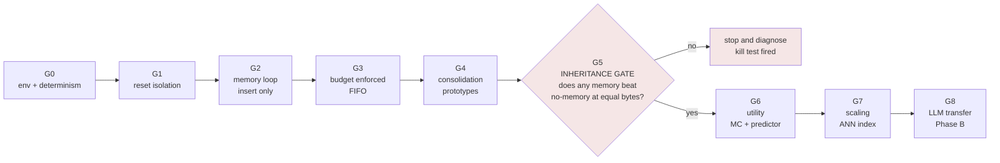

# GIM — Architecture Diagrams

## 1. System overview



Read the diagram for three things. The agent has no arrow into the store — only the compactor and consolidation write. The index hangs off the store with a dashed rebuild edge, because it is derived and never authoritative. The logger sits outside the budgeted box.

---

## 2. The generation boundary



---

## 3. Consolidation decision



The "similar but incompatible" branch is the one the whole design exists to protect. A success memory and a failure memory that are textually near-identical must never be averaged together, and cosine similarity alone cannot see the difference.

---

## 4. Utility pipeline — offline vs online



The dashed edge is the only coupling. Nothing in the online path calls a rollout. Report the two costs separately and never sum them.

---

## 5. Build order and gates



Exactly one novel component is unvalidated at any point. That ordering is the main defense against an unfinished project.

---

## 6. Byte budget composition

```
persistent bytes, per item
+-------------------------------------------------------------+
| content text        ~200 B    distilled memory               |
| centroid vector     ~1536 B   384-dim float32   <-- dominant |
| preconditions/scope ~100 B    json                           |
| sufficient stats    ~40 B     n_k, spread, max_dist          |
| provenance          ~150 B    immutable, never evicted       |
| learned fields      ~40 B     utility, confidence, info gain |
+-------------------------------------------------------------+
plus index.overhead_bytes(), which counts toward B

Roughly 75-90% of every memory is the embedding. That single fact is
what makes the symbolic-vs-dense comparison (H5) worth running, and
what makes quantization vs consolidation (H4) a real question rather
than a detail.
```
